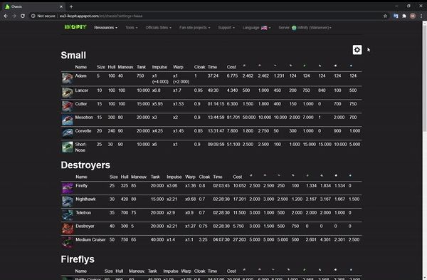

# [Ikopit](http://eu3-ikopit.appspot.com/)

[Ikopit](http://eu3-ikopit.appspot.com/) is a **non official fansite** for the deceased **online video game Empire Universe** (OGame like) published by [Looki](http://www.looki.com/) (now owned by [Gamigo](http://gamigo.com)).

Ikopit features tools to help players within the game. The project is multilingue:
- English
- French
- German

The project is written in [Java 1.7](https://en.wikipedia.org/wiki/Java_(software_platform)) and uses Java EE. The application is meant to be deployed on [Google App Engine](https://cloud.google.com/appengine). It uses [DataNucleus](https://code.google.com/archive/p/datanucleus-appengine/) to access the Google App Engine datastore via [JDO](https://cloud.google.com/appengine/docs/standard/java/datastore/jdo/overview-dn2). We use [Objectify](https://github.com/objectify/objectify) to make this easier.

The UI is written in [JavaScript ES5](https://en.wikipedia.org/wiki/JavaScript) and was initially using [Knockback.js](https://kmalakoff.github.io/knockback/). The most recent components has been written with  [ReactJs](https://reactjs.org/). [Graphviz](https://graphviz.org/) and [svg-pan-zoom](https://github.com/ariutta/svg-pan-zoom) helps us generate beautiful svg. [Bootstrap](https://getbootstrap.com/) is used for the design and the mobile experience. [Gulp](https://gulpjs.com/) helps us with task like sprite or svg generation as well as compiling jsx.

# Features

## List of chassis, components and buildings

Visualize the list of available chassis, components and buildings in the game with their statistics, cost and production time based on your settings.

## Research time calculator

Calculate how much time is remained for your research based on your advancement.

## Technology tree

Visualize the technology tree of the game to plan your researches. It also has links to each chassis, components and buildings!

## Ship builder

Design your ships as you like with all the components available from the game.

## Space battle analyzer

Analyze the performances of your ships in battles.

## Find planets using triangulation

The game only give you the distance to an unknown planet. This tool helps you find it using triangulation.

## Router planner

You can use wormholes to travel faster within the galaxy. Set a starting point and a destination then let yourself be guided.

The site also works on mobile!

# Deployment

The website is meant to be deployed on [Google App Engine](https://cloud.google.com/appengine).

There is a gulp file to help you do several things:
- assemble images as sprites.
- build the technologie tree as a svg using [Graphviz](https://graphviz.org/).
- compile the jsx files to javascript files.
- place all those files in the appropriate war sub-directories to make them available for the backend.

Then, you need to  deploy the Java EE application on [Google App Engine](https://cloud.google.com/appengine). You will need the [DataNucleus](https://code.google.com/archive/p/datanucleus-appengine/) plugin as well as [Objectify](https://github.com/objectify/objectify).

# After thought

## Lack of best practice

The site is poorly written. There would be a lot of things to change! From tooling, refactoring, coding style, tests...

## Backend mistakes

**Using the Google App Engine datastore was a mistake** for two reasons:
- It make us dependant of App Engine.
- It is useless and we could have used the local storage instead.

In fact there was **no need of a back end server** and the application could have been written as fully blown single page application!

The project would benefit a lot with a build automation tool like **maven or gradle**.
